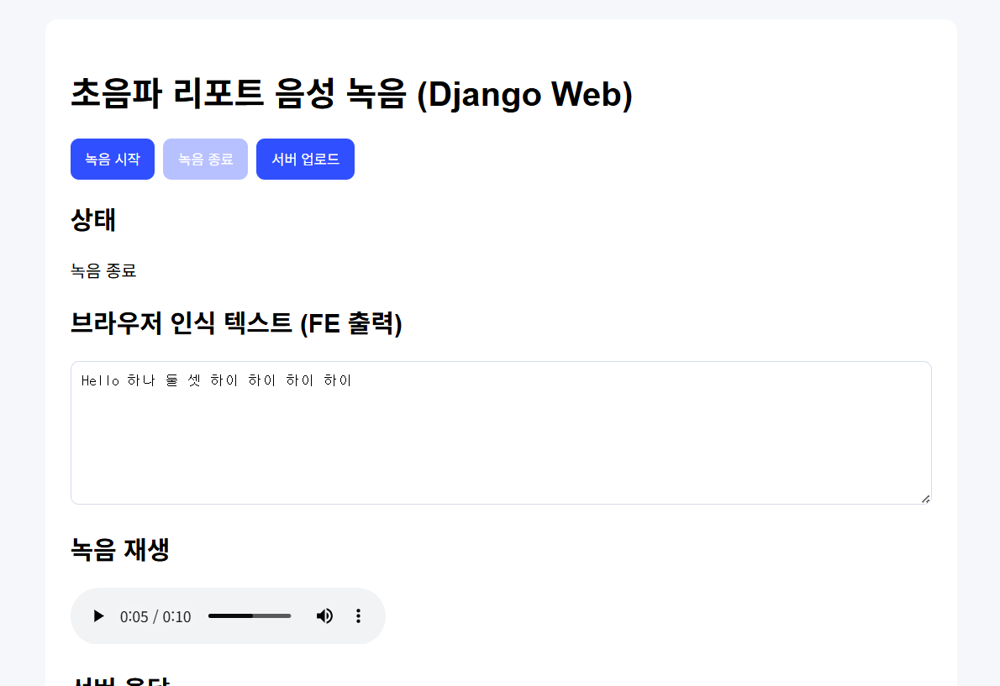

# AI Ultrasound Report PoC



---


이 저장소는 **초음파 진단 구술 자동 리포팅 PoC**입니다.
핵심 방향은 다음과 같습니다.

- 음성 입력(STT) 기반 리포트 생성 파이프라인
- 데스크톱(PySide6) 프로토타입 + Django 웹 엔진
- **Django 엔진은 WSL Ubuntu(리눅스) 기반으로 실행하는 것을 표준 환경으로 사용**

---

## 1) 표준 실행 환경 (중요)

이 레포의 Django 엔진은 **Windows 네이티브가 아니라 WSL Ubuntu에서 실행**하는 것을 기준으로 합니다.

- 권장 OS: Windows 11 + WSL2 Ubuntu 22.04/24.04
- 권장 Python: 3.11
- 권장 가상환경: 프로젝트 루트의 `.venv-linux`

> Windows `.cmd` 스크립트는 기존 데스크톱 앱 디버깅 용도로 남겨두고,
> Django 개발/테스트/실행은 전부 WSL Ubuntu 기준 커맨드를 사용합니다.

---

## 2) 레포 구조

- `web_django/` : Django 프로젝트 (`manage.py`, `config`, `recorder`)
- `core/` : STT/후처리 핵심 로직
- `ui/` : PySide6 UI 코드
- `diagnostics/` : 장치/모델 진단 스크립트
- `scripts/setup_wsl_venv.sh` : WSL Ubuntu용 venv 초기 세팅 스크립트
- `scripts/run_django_dev.sh` : WSL Ubuntu용 Django 실행 스크립트

---

## 3) WSL Ubuntu에서 venv 구성부터 Django 실행까지 (상세)

아래 순서대로 진행하면 됩니다.

### 3-1. WSL Ubuntu 진입

Windows PowerShell 또는 CMD:

```bash
wsl -d Ubuntu
```

### 3-2. 프로젝트로 이동

```bash
cd /workspace/AI_Ultrasound_report_poc
```

### 3-3. 시스템 패키지 설치

```bash
sudo apt update
sudo apt install -y python3 python3-venv python3-pip python3-dev build-essential portaudio19-dev
```

### 3-4. 가상환경 생성/활성화

```bash
python3 -m venv .venv-linux
source .venv-linux/bin/activate
python -m pip install --upgrade pip setuptools wheel
```

프롬프트에 `(.venv-linux)`가 보이면 활성화된 상태입니다.

### 3-5. Python 의존성 설치

```bash
pip install -r requirements.txt
```

### 3-6. Django DB 마이그레이션

```bash
python web_django/manage.py migrate
```

### 3-7. Django 개발 서버 실행

```bash
python web_django/manage.py runserver 0.0.0.0:8000
```

Windows 브라우저에서 `http://localhost:8000` 접속 가능.

---

## 4) 스크립트로 빠르게 실행

### 4-1. 초기 1회 세팅

```bash
bash scripts/setup_wsl_venv.sh
```

### 4-2. Django 개발 서버 실행

```bash
bash scripts/run_django_dev.sh
```

---

## 5) Django 점검 커맨드 (WSL Ubuntu)

```bash
source .venv-linux/bin/activate
python web_django/manage.py check
python web_django/manage.py test
```

---

## 6) 참고

- 데스크톱 앱 실행(`python app.py`)은 별도이며, Django 엔진 운영 기준과 분리합니다.
- 협업 시에도 Django 관련 이슈는 **WSL Ubuntu 재현 기준**으로 보고/해결합니다.
